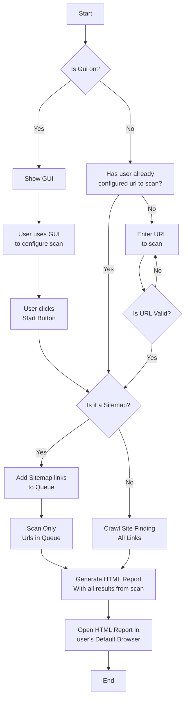
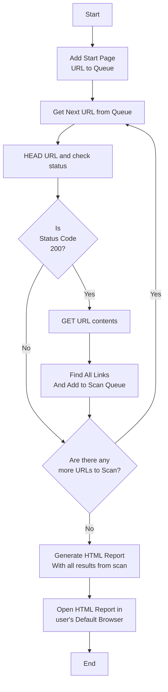
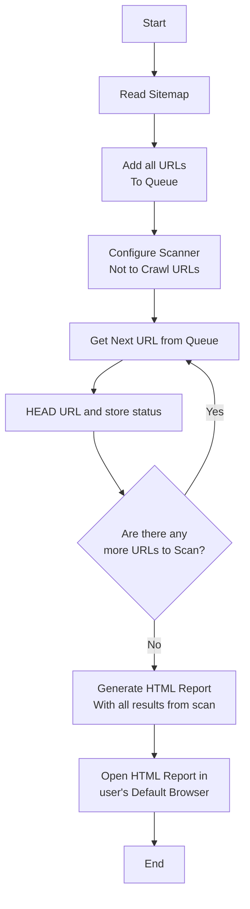

# High level flow diagram

```mermaid
flowchart TD
    A[Start] --> isGuiOn?{Is Gui on?}
    isGuiOn? -->|Yes| showGui
    showGui[Show GUI] --> configureGui
    configureGui[User uses GUI\nto configure scan] --> clickStart
    clickStart[User clicks\nStart Button] --> isSitemap?
    isGuiOn? ---->|No| configured?[Has user already\n configured url to scan?]
    configured? --> |No| enter
    configured? --> |Yes| isSitemap?
    enter[Enter URL\nto scan] --> isValid?{Is URL Valid?}
    isValid? -->|No| enter
    isValid? -->|Yes| isSitemap?{Is it a Sitemap?}
    isSitemap? --> |Yes| configSitemap
    configSitemap[Add Sitemap links\n to Queue] --> scanSitemap
    isSitemap? --> |No| crawlSite
    scanSitemap[Scan Only \nUrls in Queue] --> generateReport
    crawlSite[Crawl Site Finding\n All Links] -->generateReport
    generateReport[Generate HTML Report\n With all results from scan] --> openReport
    openReport[Open HTML Report in \nuser's Default Browser] --> finish[End]
```

# Scan WebSite

```mermaid
flowchart TD
    start[Start] --> scanUrl
    scanUrl[Add Start Page\n URL to Queue] --> getNextUrl
    getNextUrl[Get Next URL from Queue] --> readUrl
    readUrl[HEAD URL and check status] --> isGood?{Is \nStatus Code\n 200?}
    isGood? --> |No| moreToScan?
    isGood? --> |Yes| processUrl
    processUrl[GET URL contents] --> findAllLinks
    findAllLinks[Find All Links\nAnd Add to Scan Queue] --> moreToScan?
    moreToScan?{Are there any\n more URLs to Scan?} -->|Yes| getNextUrl    
    moreToScan? -->|No| generateReport
    generateReport[Generate HTML Report\n With all results from scan] --> openReport
    openReport[Open HTML Report in \nuser's Default Browser] --> finish[End]
```

# Scan Sitemap

```mermaid
flowchart TD
    start[Start] --> scanUrl
    scanUrl[Read Sitemap] --> addUrlsToQueue
    addUrlsToQueue[Add all URLs\nTo Queue] --> configNoCrawl
    configNoCrawl[Configure Scanner\nNot to Crawl URLs] --> getNextUrl
    getNextUrl[Get Next URL from Queue] --> readUrl
    readUrl[HEAD URL and store status] --> moreToScan?
    moreToScan?{Are there any\n more URLs to Scan?} -->|Yes| getNextUrl    
    moreToScan? -->|No| generateReport
    generateReport[Generate HTML Report\n With all results from scan] --> openReport
    openReport[Open HTML Report in \nuser's Default Browser] --> finish[End]
```